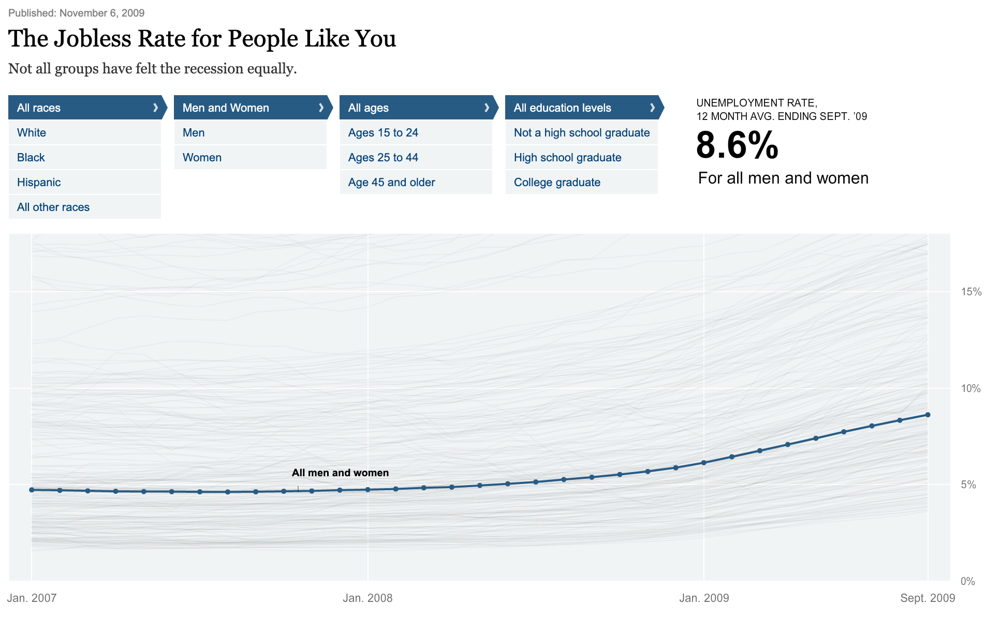

# The Jobless Rate for People Like You
## Not all groups have felt the recession equally.

[Original Graphic](https://archive.nytimes.com/www.nytimes.com/interactive/2009/11/06/business/economy/unemployment-lines.html?_r=0) by Shan Carter, Amanda Cox, and Kevin Quealy of The New York Times.

As this is still one of my favourite examples of what data visualisation can do, I have extracted the data for educational purpose.

Find the [Jupyter Notebook (using Julia)](data/Data wrangling.ipynb) to read about the data extraction process.

Here is an [Observable Notebook](observablehq.com/@jnsprnw/the-jobless-rate-for-people-like-you) to play with the data.
